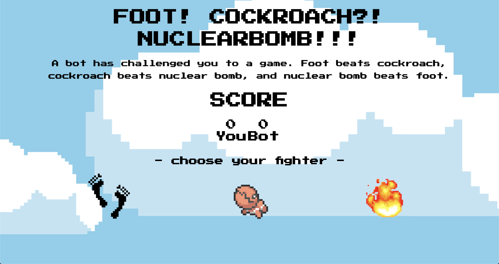

# Rock, Paper, Scissors
#### Project Scope: Design functional inBrowser Rock, Paper, Scissors game. The player and bot select their choice. The winner gets a point added to their score. Depending on the outcome, a dialogue is displayed reflecting the bot's feelings. 
#### View here: https://svdev-rps.netlify.com

# How it was made:
#### HTML5, CSS3, Javascript E6

# Optimizations
#### Once a selection is made, the browser displays the bots choice above the score. 

# Lesson Learned: 
#### Onlick is a method in Javascript that enables a programmer to link functions with events in the web browser. The outcome of rock, paper, scissors is defined by the methods used in the functions, such as math.floor() and math.random(). Functions can be called upon and used within other functions.   
